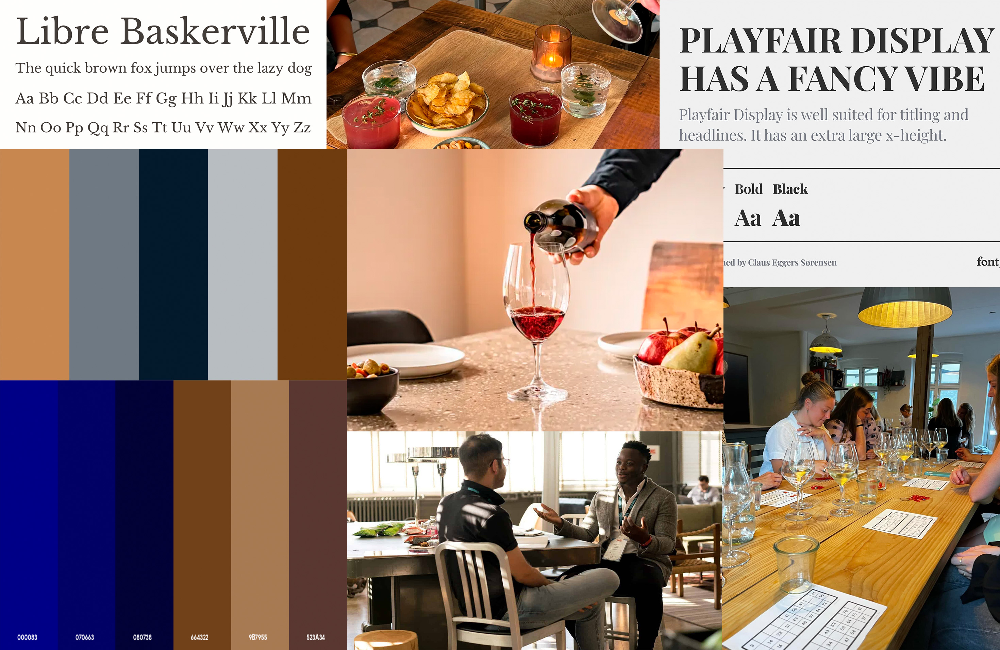

# Markdown Dokumentation

- det gør det læseligt
- gør det overskueligt 

Nedenfor vises et simpelt eksempel på, hvordan man bruger et **for-loop** til at gennemløbe et array og udskrive hvert element til konsollen:

```javascript
// Opret et array med nogle værdier
const frugter = ["Æble", "Banan", "Kirsebær", "Mango"];

// Brug et for-loop til at iterere gennem arrayet
for (let i = 0; i < frugter.length; i++) {
  console.log(frugter[i]); // Udskriver hvert element 

  # Eksempel: Navigation med 3 links i HTML


Nedenfor vises et simpelt eksempel på, hvordan man kan opbygge en navigation med tre links:

```html
<!-- Navigation med 3 links -->
<nav>
  <ul>
    <li><a href="#home">Hjem</a></li>
    <li><a href="#about">Om os</a></li>
    <li><a href="#contact">Kontakt</a></li>
  </ul>
</nav>



*Strive to be great.*   
> — LeBron James, *NBA*, 2011

